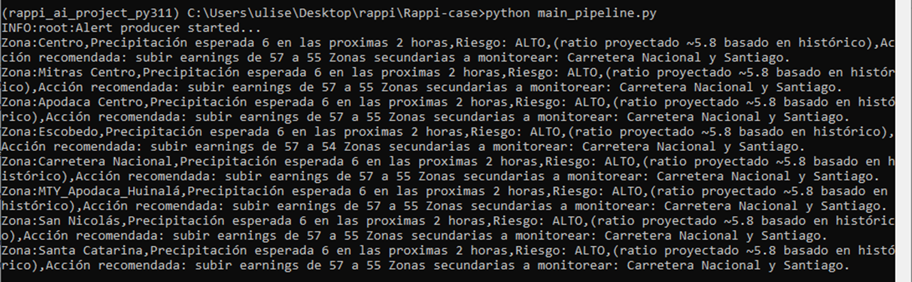

# Módulo 2. Motor de alertas

En esta carpeta podrás encontrar los siguientes archivos:

*   Motor de alertas en formato py → [motor_alertas.py](motor_alertas.py)
*   Motor de alertas + LLM + AI Agente + Telegram en formato py → [Original-Monolito-Motor-Alertas.py](Original-Monolito-Motor-Alertas.py)
*   Documento PDF que justifica los umbrales y las reglas del motor → [Justificación_de_los_umbrales_y_reglas_del_motor.pdf](Justificación_de_los_umbrales_y_reglas_del_motor.pdf)

**Evidencia**

