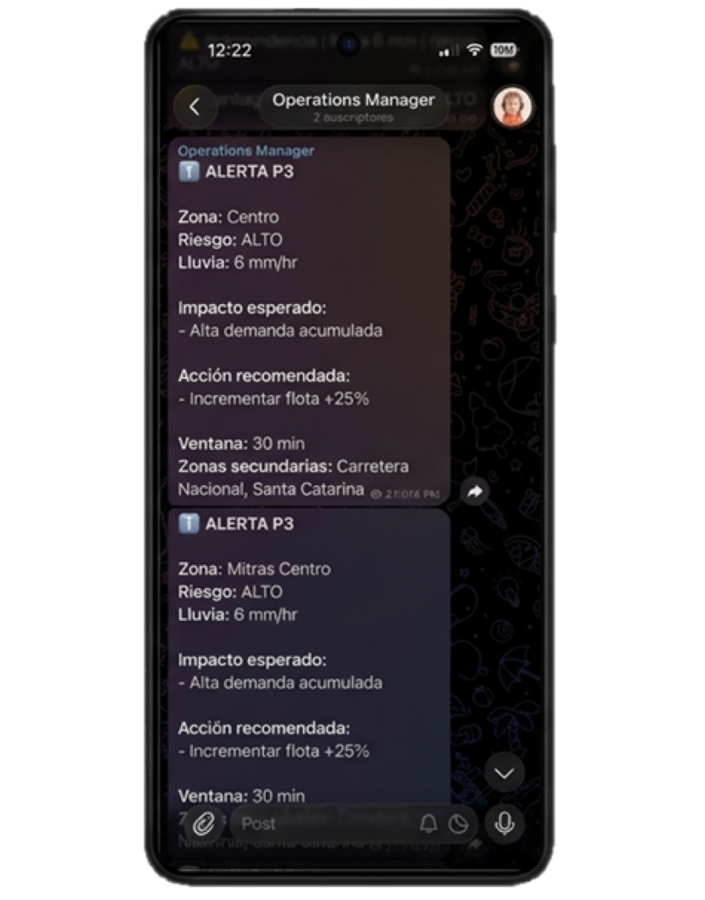

# Modulo 3. Agente de Telegram

En esta carpeta podrás encontrar los pasos a seguir para configurar las integraciones Gemini + Telegram:

<div>
    <div align="center">
    
</div>


## Integración del modelo Gemini - 2.5 flash LLM


Utilice la API de Gemini en su versión 2.5 flash para solicitar la KEY API, tenemos que seguir los siguientes pasos:

1. Ir a [Google AI Studio](https://aistudio.google.com/) 
2. Accede con tu cuenta de Gmail o crea una cuenta.
3. Selecciona en el panel inferior derecho la opción Get API Key. 
4. Crear clave de API.
5. Crear un proyecto (aquí le das el nombre de tu proyecto, en nuestro caso: ``` Rappi Project ```)
6. Le das crear clave.
7. Visualizarás un registro con tu clave (selecciona el icono de copiar para copiar tu clave).
8. Resérvala para ponerla en la línea 13 del archivo [alerts_notify.py](alerts_notify.py).

Precio

    Input
        USD 2.00, instrucciones <= 200,000 tokens
        USD 4.00, instrucciones > 200,000 tokens

    Output
        USD 12.00, instrucciones <= 200 000 tokens
        USD 18.00, instrucciones > 200 000

[Referencia](https://ai.google.dev/gemini-api/docs/pricing?hl=es-419)

---

## Funcionalidad del bot de Telegram

Para poder tener funcionando nuestro bot, es importante que sigamos los siguientes pasos: 


## Creación del Bot
1. Presionaremos el botón de buscador.
2. Buscaremos la cuenta verificada de BotFather.
3. Escribe el siguiente comando: ```/start```
4. Después: ```/newbot```
5. Nos pedirá definir el nombre del bot, en nuestro caso: ```rappi_monitoring_bot```
6. Aparecerá el token (es importante que lo guardemos).
7. Resérvala para ponerla en la línea 11 del archivo [alerts_notify.py](alerts_notify.py).


## Creamos el canal de Telegram
1. Iremos a la pestaña de chats.
2. Presionaremos el botón de Nuevo mensaje .
3. Seleccionamos la opción Nuevo canal.
4. Crear canal.
5. Definimos un nombre para nuestro canal: ```Operations Manager```, acto seguido le damos a siguiente.
6. Lo configuramos privado y siguiente.
7. Una vez creado, nos aparecerá nuestro canal donde podremos ver los mensajes del canal generados por el bot.

## Agregamos el bot al canal
1. Presionamos el botón que dice el nombre de nuestro canal Operations Manager.
2. Seleccionamos administradores.

3. Añadir administrador.
4. Ponemos el nombre de nuestro bot: ```@rappi_monitoring_bot```
5. Presionamos el botón de guardar cambios.


## Obtener el token del canal,

1. Vamos a mandar un mensaje al grupo: Hola Mundo
2. Después vamos a enviar un request por el navegador con https://api.telegram.org/bot<token>/getUpdates
3. Ahora vamos a copiar el id de nuestro canal, el cual viene en la variable chat (se ve algo como):
```
chat: {
    id: -100XXXX,
    title: "Operations Manager",
    type: "channel"
},
```

4. Lo copiamos y lo ponemos en la línea 12 del archivo [alerts_notify.py](alerts_notify.py).

---

El costo estimado por día es de $0.13 centavos de dólar.

Si se hace el request cada 2 horas para 14 zonas, eso equivale a 12 requests por zona al día, o 168 requests diarios en total. 
Suponiendo que cada request genere unos 500 tokens y el costo sea aproximadamente $0.0015 USD por 1,000 tokens, el gasto diario sería alrededor de $0.13 USD/día, o unos $3.80 USD al mes. 

**Nota:** El costo real puede variar según la cantidad exacta de tokens generados por cada request y los precios oficiales del plan que uses.

<br>
    <div align="center">
    
</div>